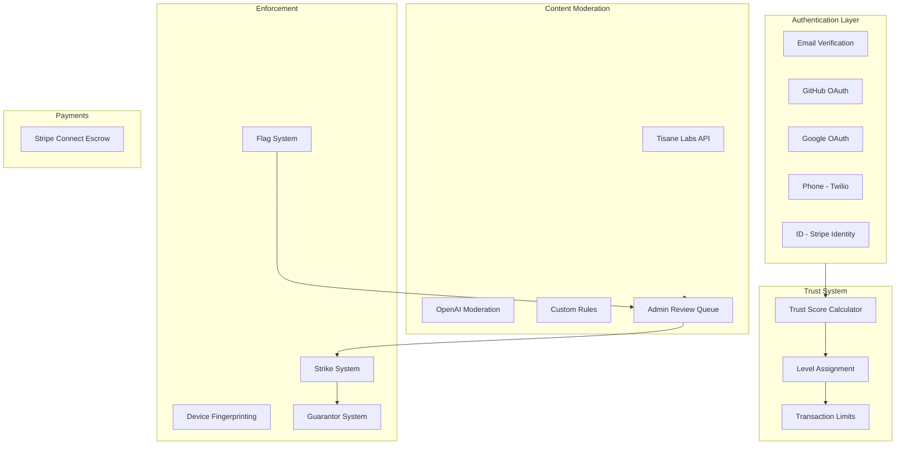
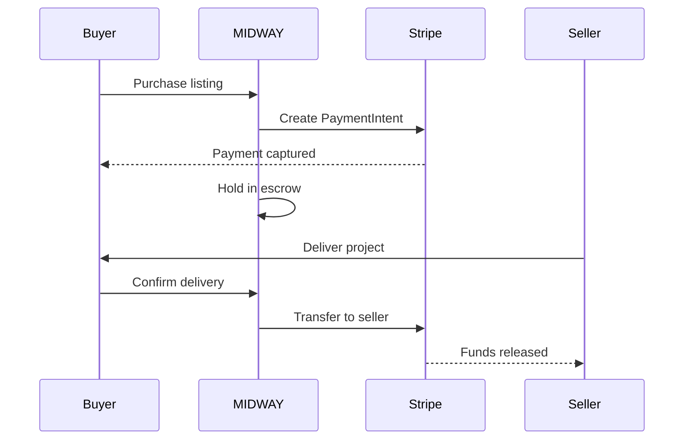

# MIDWAY Security Enhancement Plan

## Architecture Overview




---

## Phase 1: Core Authentication & Trust System

### 1.1 Database Schema Updates

Add to Supabase:

**Users table additions:**

- `phone` (text, nullable)
- `phone_verified` (boolean, default false)
- `github_connected` (boolean, default false)
- `google_connected` (boolean, default false)
- `id_verified` (boolean, default false)
- `profile_complete` (boolean, default false)
- `trust_score` (integer, default 0)
- `trust_level` (enum: unverified, basic, verified, trusted, elite)
- `successful_sales` (integer, default 0)
- `account_status` (enum: active, deactivated, banned)
- `device_fingerprints` (jsonb array)
- `strikes` (integer, default 0)
- `sponsor_id` (uuid, nullable, references users)

**New tables:**

- `reports` - Flag/report tracking
- `user_bans` - Ban records with device fingerprints
- `transactions` - Escrow transaction tracking
- `guarantors` - Guarantor identity storage

### 1.2 Trust Score Implementation

Create `src/lib/trustScore.ts`:

```typescript
const POINTS = {
  email_verified: 10,
  profile_complete: 5,
  github_connected: 20,
  google_connected: 10,
  phone_verified: 25,
  id_verified: 50,
  first_listing: 15,
  five_sales: 30,
  one_year: 20
}

function calculateTrustScore(user): number
function getTrustLevel(score): TrustLevel
```

### 1.3 OAuth Providers

Configure in Supabase Dashboard:

- GitHub OAuth (Application settings)
- Google OAuth (Cloud Console)

Create `src/components/auth/OAuthButtons.tsx` for login/signup UI.

---

## Phase 2: Payment Escrow System

### 2.1 Stripe Connect Integration

- Create Stripe Connect account
- Configure in `.env.local`
- Create `src/lib/stripe.ts` for Stripe client
- Create `src/app/api/stripe/` routes:
  - `connect/route.ts` - Seller onboarding
  - `checkout/route.ts` - Create payment intent
  - `webhook/route.ts` - Handle events

### 2.2 Transaction Flow




---

## Phase 3: Content Moderation

### 3.1 Tisane Labs API Integration

Create `src/lib/moderation/tisane.ts`:

- Check toxicity, spam, profanity, personal attacks
- Returns explainable abuse detection with severity levels
- Supports 35 languages with anti-algospeak (catches obfuscated slurs)
- Free tier: 50,000 requests/month

### 3.2 OpenAI Moderation API

Create `src/lib/moderation/openai.ts`:

- Policy violation detection
- Free tier usage

### 3.3 Custom Rules Engine

Create `src/lib/moderation/rules.ts`:

- Scam keyword detection
- Pricing anomaly flags
- URL validation (repo exists)

### 3.4 Moderation Pipeline

Create `src/lib/moderation/index.ts`:

- Combine all checks
- Return pass/fail with reasons
- Auto-approve or queue for review

---

## Phase 4: Flag & Strike System

### 4.1 Report/Flag System

Create `src/app/api/reports/route.ts`:

- Create report endpoint
- Track flags per listing
- Trigger admin queue at 5 flags

### 4.2 Admin Review Queue

Create `src/app/admin/` pages:

- `queue/page.tsx` - Flagged listings
- `users/page.tsx` - User management
- `reports/page.tsx` - Report details

### 4.3 Strike System Logic

- 1st deletion = Strike 1 (warning)
- 2nd deletion = Account deactivated
- Update `account_status` to 'deactivated'

---

## Phase 5: Ban Evasion Prevention

### 5.1 Device Fingerprinting

Create `src/lib/fingerprint.ts`:

- Canvas fingerprint
- WebGL fingerprint
- Audio fingerprint
- Font detection
- Screen/browser properties

### 5.2 Fingerprint Storage & Matching

- Store fingerprints on login/signup
- Check against banned fingerprints
- Block matching devices

---

## Phase 6: Guarantor System

### 6.1 Guarantor Flow

Create `src/app/reinstatement/` pages:

- `request/page.tsx` - Deactivated user requests
- `sponsor/page.tsx` - Guarantor verification form

### 6.2 Guarantor Requirements

- Must complete full verification (email, phone, ID)
- Identity stored as collateral
- Linked to reinstated user
- Both banned if reinstated user re-offends

---

## Phase 7: Phone Verification (Twilio)

### 7.1 Supabase Phone Auth Setup

- Configure Twilio credentials in Supabase Dashboard
- Add Twilio Account SID, Auth Token, Phone Number

### 7.2 Phone Verification UI

Create `src/components/auth/PhoneVerification.tsx`:

- Phone number input
- OTP code entry
- Verification status display

---

## Phase 8: ID Verification (Stripe Identity)

### 8.1 Stripe Identity Integration

Create `src/app/api/identity/route.ts`:

- Create verification session
- Handle webhook results
- Update user `id_verified` status

---

## Phase 9: Legal Documents

### 9.1 Terms of Use

Create `src/app/legal/terms/page.tsx`:

- User obligations
- Seller/buyer responsibilities
- Prohibited activities (scamming, fraud, IP theft)
- Account termination rules
- Dispute resolution

### 9.2 Privacy Policy

Create `src/app/legal/privacy/page.tsx`:

- Data collected
- Purpose of collection
- Third-party services (Supabase, Stripe, Twilio)
- User rights (GDPR/CCPA)
- Data retention
- Cookie policy

---

## Files to Create


| File                                        | Purpose                 |
| ------------------------------------------- | ----------------------- |
| `src/lib/trustScore.ts`                     | Trust score calculation |
| `src/lib/stripe.ts`                         | Stripe client setup     |
| `src/lib/moderation/tisane.ts`              | Tisane Labs API         |
| `src/lib/moderation/openai.ts`              | OpenAI Moderation       |
| `src/lib/moderation/rules.ts`               | Custom rules            |
| `src/lib/moderation/index.ts`               | Pipeline orchestrator   |
| `src/lib/fingerprint.ts`                    | Device fingerprinting   |
| `src/components/auth/OAuthButtons.tsx`      | OAuth login buttons     |
| `src/components/auth/PhoneVerification.tsx` | Phone verify UI         |
| `src/components/TrustBadge.tsx`             | Display trust level     |
| `src/app/api/stripe/*`                      | Stripe endpoints        |
| `src/app/api/reports/route.ts`              | Flag/report endpoint    |
| `src/app/api/identity/route.ts`             | ID verification         |
| `src/app/admin/*`                           | Admin dashboard pages   |
| `src/app/legal/terms/page.tsx`              | Terms of Use            |
| `src/app/legal/privacy/page.tsx`            | Privacy Policy          |
| `src/app/reinstatement/*`                   | Guarantor flow          |
| `instructions/security-enhancements.md`     | This plan documented    |


---

## Environment Variables Needed

```env
# Stripe
STRIPE_SECRET_KEY=
STRIPE_PUBLISHABLE_KEY=
STRIPE_WEBHOOK_SECRET=

# Twilio (via Supabase)
# Configured in Supabase Dashboard

# Tisane Labs (replaces Perspective API - sunsetting Dec 2026)
TISANE_API_KEY=

# OpenAI (for moderation - free endpoint)
OPENAI_API_KEY=
```

---

## Third-Party Setup Required

1. **Stripe Connect** - Create account, enable Connect
2. **Stripe Identity** - Enable in Stripe Dashboard
3. **Twilio** - Create account, get credentials, buy phone number
4. **Tisane Labs** - Sign up at [tisane.ai](https://tisane.ai), get API key (free tier: 50K req/mo)
5. **GitHub OAuth** - Create OAuth App in GitHub settings
6. **Google OAuth** - Create OAuth credentials in Cloud Console

